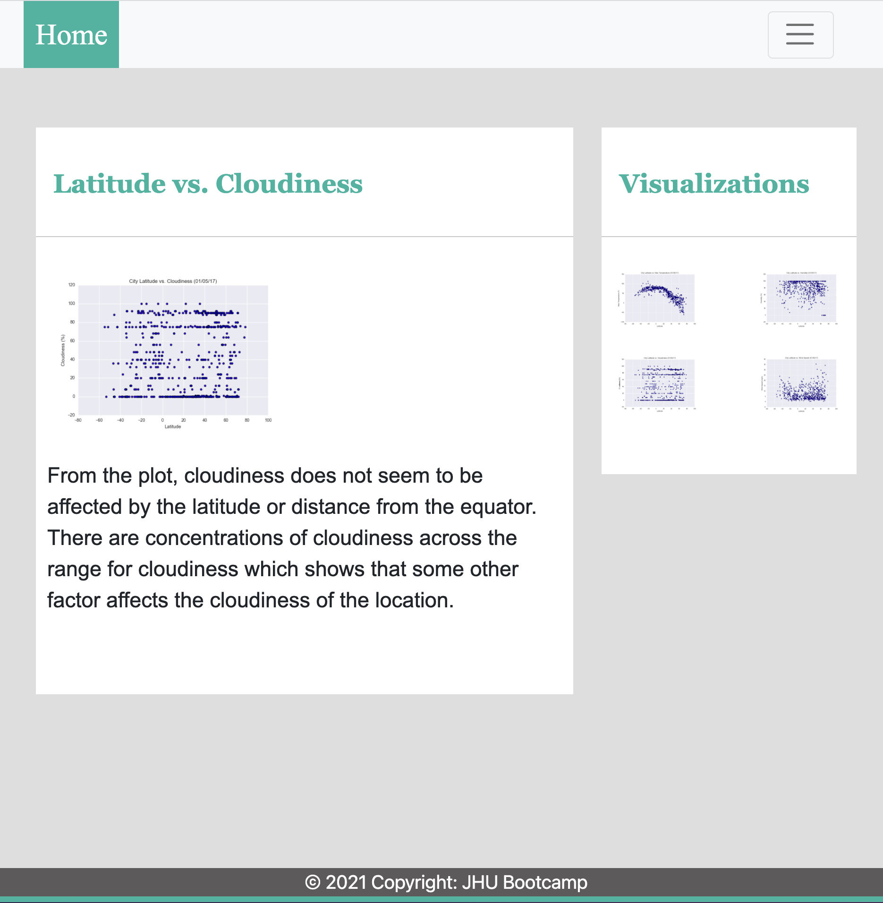

# Web-Design-Challenge - Web Visualizatoin Dashboard (Latitude)
Data is more powerful when we share it with others! Let's take what we've learned about HTML and CSS to create a dashboard showing off the analysis we've done.

We have created a visualization dashboard website using visualizations we've created in a past assignment. Specifically, we have plotted weather data.

In building this dashboard, we have created individual pages for each plot and a means by which we can navigate between them. These pages contain the visualizations and their corresponding explanations. We also have a landing page, a page where we can see a comparison of all of the plots, and another page where we can view the data used to build them.

## Landing Page:

This page contains the following:

* An explanation of the project.
* Links to each visualizations page. There should be a sidebar containing preview images of each plot, and clicking an image should take the user to that visualization.

## Visualization Pages:

The Visualization pages contain the following:

* A descriptive title and heading tag.
* The plot/visualization itself for the selected comparison.
* A paragraph describing the plot and its significance.

<b>Latitude vs. Max Temperature (Large View)</b>

               
<b>Latitude vs. Max Temperature (Small View)</b>

 

<b>Latitude vs. Humidity (Large View)</b>

<<b>Latitude vs. Humidity (Small View)</b>

 

<b>Latitude vs. Cloudiness (Large View)</b>

<b>Latitude vs. Cloudiness (Small View)</b>

              

<b>Latitude vs. Wind Speed (Large View)</b>

               
<b>Latitude vs. Wind Speed (Small View)</b>

## "Comparisons" Page:

This page contains the following:

* Contains all of the visualizations on the same page so we can easily visually compare them.
* Uses a Bootstrap grid for the visualizations.
* The grid is two visualizations across on screens medium and larger, and 1 across on extra-small and small screens.

<b>Comparisons Page (Large View)</b>

               
<b>Comparisons Page (Small View)</b>

## "Data" Page:

This page contains the following:

* Displays a responsive table containing the data used in the visualizations.
* The table is a bootstrap table component.
* The data came from exporting the .csv file as HTML, or converting it to HTML. 
* We used Pandas which has has a nifty method approprately called to_html that allows you to generate a HTML table from a pandas dataframe.

## About the Website:

* The website, at the top of every page, has a navigation menu that:

    - Has the name of the site on the left of the nav which allows users to return to the landing page from any page.
    - Contains a dropdown menu on the right of the navbar named "Plots" that provides a link to each individual visualization page.
    - Provides two more text links on the right: "Comparisons," which links to the comparisons page, and "Data," which links to the data page.
    - Is responsive (using media queries). The nav must have similar behavior as the screenshots "Navigation Menu" section (notice the background color change).
    - The website must be deployed to GitHub pages.

